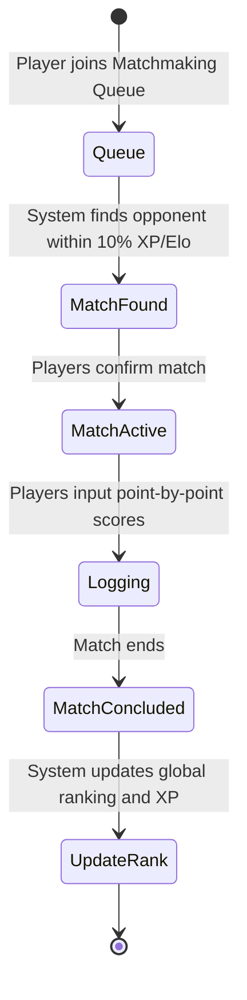
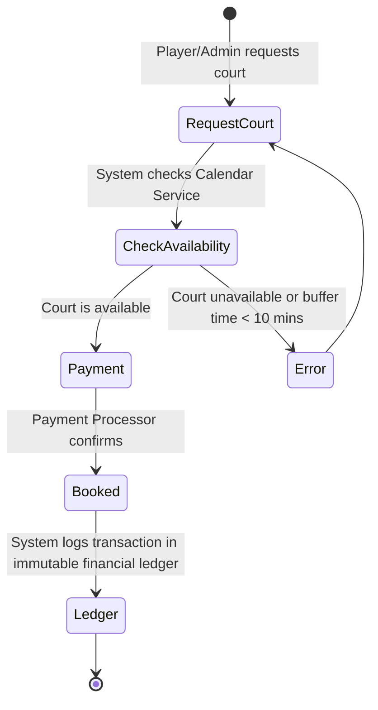
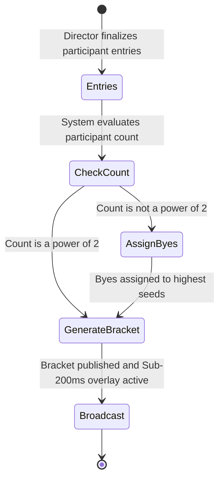

# 2 Overall Description

This section serves as an introduction to the system as a whole, starting with a high-level overview in the form of a use case diagram, and then going into the details of the main use cases through workflow models. Additionally, the user characteristics, general constraints, and assumptions and dependencies are detailed in this section.

## 2.1 Product Perspective

Tennis Suite works together with adjacent systems—including an external Payment Processor, a Calendar Service, and an Email/Notification Service—to bring each use case to fruition. The major use cases that this application provides include matchmaking, court booking and facility management, and tournament generation and broadcasting.

The use case diagram below showcases the interaction between Tennis Suite and its human and external actors.

```mermaid
usecaseDiagram
    actor Player as "Player"
    actor Admin as "Facility Manager"
    actor Director as "Tournament Director"
    
    actor PaymentService as "<<actor>>\nPayment Processor"
    actor CalendarService as "<<actor>>\nCalendar Service"

    package "Tennis Suite" {
        usecase Matchmaking as "Matchmaking & Score Logging"
        usecase CourtBooking as "Court Booking & Allocation"
        usecase Tournaments as "Tournament Bracket Generation"
    }

    Player --> Matchmaking
    Player --> CourtBooking
    Admin --> CourtBooking
    Director --> Tournaments
    
    Matchmaking --> CalendarService
    CourtBooking --> PaymentService
    CourtBooking --> CalendarService
    Tournaments --> PaymentService
```

### Actor Descriptions

- **Player**: These are the primary human actors interacting with the system to join matchmaking queues, log point-by-point scores, and book courts.
- **Facility Manager (Admin)**: Human actors who oversee court allocations, manage the financial ledger, and ensure courts are not double-booked.
- **Tournament Director**: Human actors who manage tournament entries, generate brackets, and assign byes.
- **Payment Processor**: A non-human actor (e.g., Stripe) that handles transactions for court fees and tournament entries.
- **Calendar Service**: A non-human actor that coordinates scheduling, court availability, and sends data to the system regarding match times.
- **Email Service**: A non-human actor that sends data to users, such as match reminders and referee alerts.

## 2.2 Product Features

### Workflow Models

The workflow models presented below are activity diagrams that depict the general flow of control of the use cases.

#### Use Case 1: Matchmaking & Score Logging



#### Use Case 2: Court Booking



#### Use Case 3: Tournament Generation



### User Stories

Using the format: `As a <user/role>, I want <something>, so that <benefit is achieved>.`

**Use Case 1: Matchmaking & Score Logging**
- As a Player, I want to join a matchmaking queue, so that I can find an opponent within a 10% skill differential based on my XP/Elo.
- As a Player, I want to input my match scores point-by-point, so that the score state is accurately logged in real time.
- As a Player, I want my global ranking and XP automatically updated upon match conclusion, so that my progression is seamlessly tracked.

**Use Case 2: Court Booking**
- As a Facility Manager, I want the system to automatically allocate available courts, so that overlaps are prevented.
- As a Facility Manager, I want the system to enforce a minimum 10-minute buffer time between bookings, so that players have time to transition off the court.
- As a Facility Manager, I want all transaction events logged into an immutable financial ledger, so that I have a reliable audit trail for court fees.

**Use Case 3: Tournament Generation & Broadcasting**
- As a Tournament Director, I want the system to automatically generate brackets, so that I don't have to manually draw single-elimination or round-robin paths.
- As a Tournament Director, I want the system to automatically assign byes to the highest seeds if participants aren't a power of 2, so that the bracket remains balanced.
- As a Broadcaster, I want a real-time scoreboard overlay accessible via a URL, so that I can broadcast matches with sub-200ms delay.
- As a Referee, I want to be automatically alerted if a match exceeds its scheduled duration by more than 15 minutes, so that I can investigate and keep the tournament on schedule.

## 2.3 User Characteristics

- **Recreational Player**: Ranges from beginners to highly competitive amateurs. They want a frictionless way to find matches and track their skill improvements. They are generally comfortable with mobile applications but require a straightforward and engaging interface.
- **Facility Manager**: A busy administrator balancing court schedules, payments, and staff. They require robust administrative tools, reliable audit logs, and automated scheduling that reduces their manual workload.

## 2.4 General Constraints

The technological and functional constraints that the system must adhere to are:
- **Hosting**: The system must be hosted on Vercel and utilize Turbopack for local development.
- **Styling**: Styling must be implemented strictly via Vanilla CSS Modules to ensure lightweight payload and strict encapsulation.
- **Security**: All role-based access must be enforced at the Edge Middleware level via stateless JWT verification. Database queries must be executed via Prisma ORM to prevent SQL injection.
- **Performance**: API routes handling scoring telemetry must respond within 100ms at the edge. The SSE connection must support up to 5,000 concurrent listeners per tenant.
- **Architecture**: The architecture must support multi-tenant deployments via subdomain routing (e.g., `club1.tennissuite.dev`).

## 2.5 Assumptions and Dependencies

In order to satisfy use case requirements, the system depends on several external systems. (Note: These services are currently stubbed in our documentation and will be wired in future iterations).

- **[Payment Processor](stubs/payment_processor.md)**: Required to handle `RainmakerFee` and `PartnerPayout` models. Assumes the API will accurately report transaction success.
- **[Calendar Service](stubs/calendar_service.md)**: Required for retrieving court availability and scheduling matches.
- **[Notification Service](stubs/notification_service.md)**: Required for sending match reminders and automated alerts to Referees.
- **General**: Every player has a registered account and reliable internet access on a mobile device.
