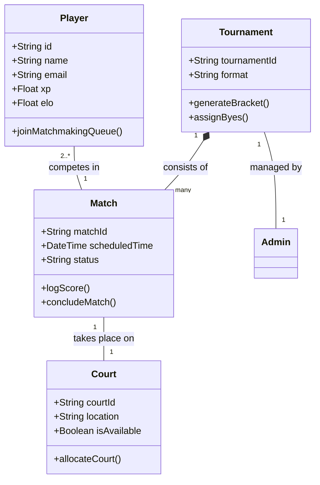
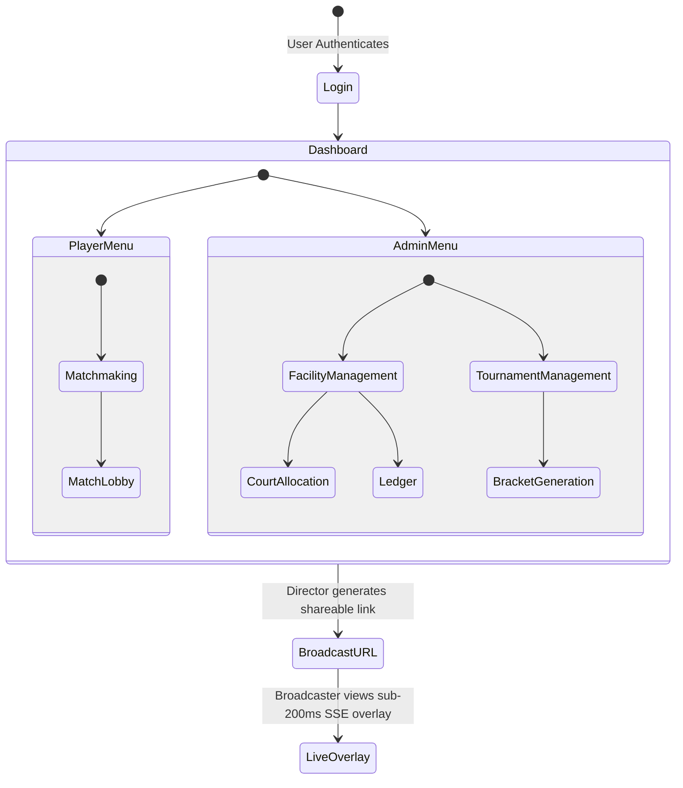

# 3 Interface Specification

This section contains details about the technical aspects of the requirements and specifications related to the Tennis Suite system. This includes UML domain models, notes on UI sketches, state machine models (navigation), and quality requirements.

## 3.1 Domain Models and UI Sketches

### Domain Models

The specification domain model represents a graphical data dictionary of the vocabulary used in Tennis Suite.

### UI Sketches

> [!NOTE]
> Detailed UI sketches and wireframes for the Player Dashboard, Tournament Bracket View, and Broadcaster Overlay have been deferred to the product backlog. They will be generated in a subsequent design phase to preserve focus on core architecture. Please refer to `BACKLOG.md`.

## 3.2 Scenarios and State Machine Models

### Overarching Navigation Diagram

The state machine model below represents the overarching navigation of the web application for different roles.

## 3.3 Quality Requirements

Based on the Non-Functional Requirements defined for the Tennis Suite, the quality attributes prioritize **Performance**, **Security**, and **Reliability**.

### Performance
- **Telemetry Latency**: API routes handling scoring telemetry must respond within 100ms at the edge.
- **Broadcasting Delay**: The Server-Sent Events (SSE) broadcasting overlay must maintain a sub-200ms delay to ensure a real-time experience for viewers.
- **Scale**: The SSE connection must support up to 5,000 concurrent listeners per tenant without dropping the stream.

### Security
- **Access Control**: Role-Based Access Control (RBAC) must enforce access to specific routes (e.g., `/referee` or `/director`) at the Edge Middleware level via stateless JWT verification.
- **Injection Prevention**: Database queries must be exclusively executed via the Prisma ORM to prevent SQL injection vulnerabilities.

### Reliability & Validation
- **Outlier Detection**: The system must flag matches where the score input frequency deviates from historical norms by more than 3 standard deviations (anti-smurfing/botting measures).
- **Ledger Immutability**: All financial transactions (RainmakerFee, PartnerPayout) must be recorded in an immutable ledger structure.
- **Dispute Resolution**: The deterministic event-sourced scoring engine calculates game states (Love, 15, 30, 40, Deuce, Ad) and tiebreak edge cases accurately to reduce dispute times by 80%.
