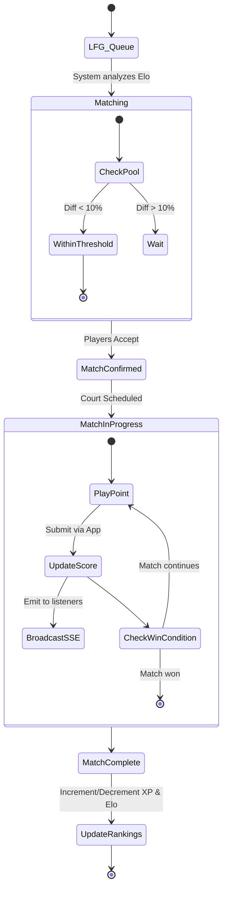
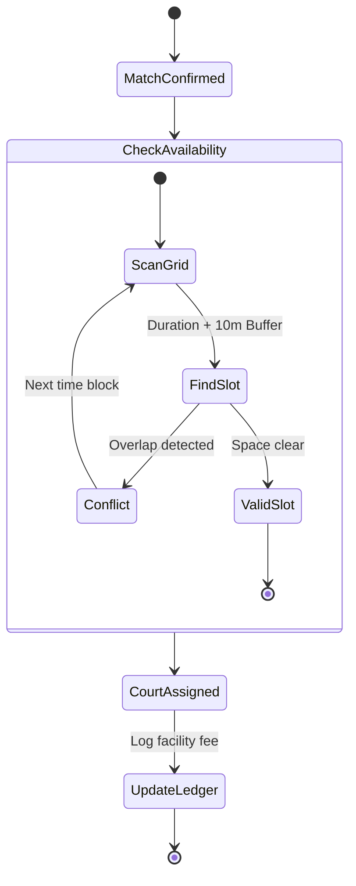
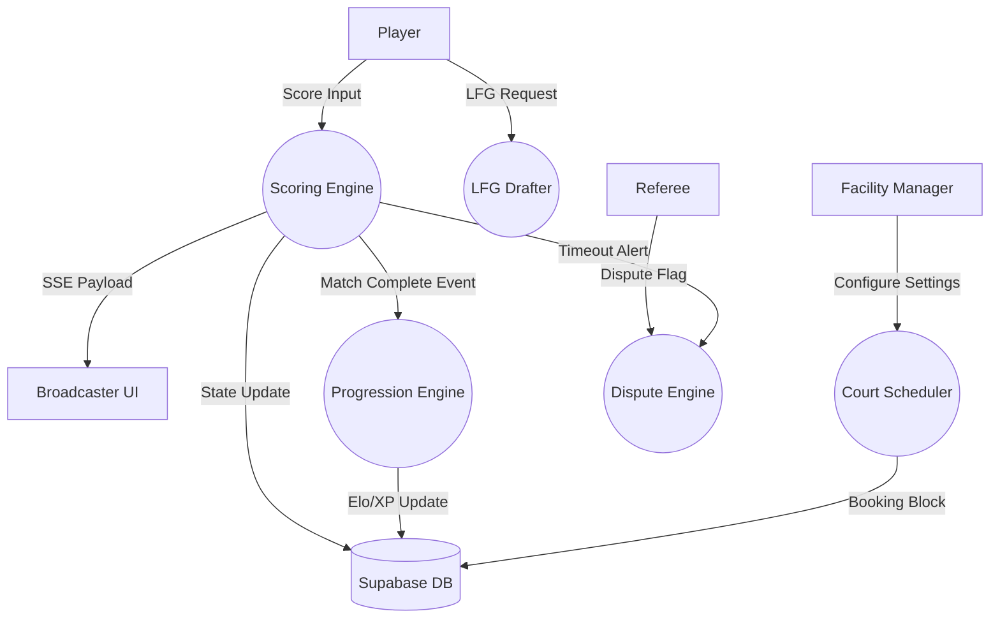

# Workflow & Systems Modeling

## 1. Activity UML: Matchmaking & Scoring (Player Journey)

## 2. Activity UML: Automated Court Scheduling (Facility Manager Journey)

## 3. Dataflow Diagram (Context Level 0)

