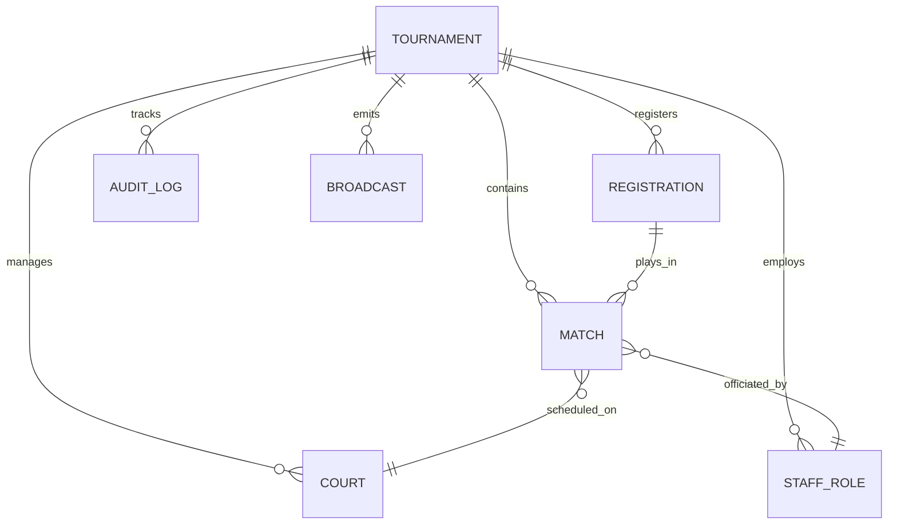

# The Tournament Object: Architectural Blueprint

In the context of the Tennis Suite, a **Tournament** is not just a folder for matches. It is a **living state machine** and the central nervous system of the entire application. Every action taken by a Host, Delegate, Marshall, Umpire, Broadcaster, or Network Admin is fundamentally a read or write operation against this single object.

---

## 1. How It Exists in the Database

In a relational database (like PostgreSQL via Prisma), the Tournament is the **Root Node**. It does not exist in isolation; it is the center of a massively interconnected web of data.

### The Multi-Tenant Reality
The object will likely have an `organizationId` or `hostId`. This means a single database table can hold thousands of tournaments for different tennis clubs, but the data is strictly partitioned so one Host cannot accidentally mutate another Host's tournament.

---

## 2. Core Attributes (Data)

The Tournament object is composed of several logical blocks of data:

### Meta Attributes
*Static or slowly changing data defining the event.*
- `id`: UUID (Primary Key)
- `name`: String (e.g., "Summer Open 2026")
- `location`: String (e.g., "Central Park Tennis Center")
- `startDate` / `endDate`: DateTime
- `status`: Enum (`DRAFT`, `REGISTRATION_OPEN`, `LIVE`, `SUSPENDED`, `COMPLETED`, `CANCELLED`)

### Global State Attributes
*Highly volatile state flags driving the real-time sandboxes.*
- `isSystemSuspended`: Boolean (The Delegate's Kill Switch)
- `activeWeatherAlert`: String | Null (e.g., "Rain Delay")
- `lastStateHash`: String (Used by the Network Guy to verify if local devices are fully synced)

### Financial Attributes (The Treasury)
*The fiscal reality of the event.*
- `entryFee`: Float
- `totalPrizePool`: Float
- `collectedRevenue`: Float (Calculated dynamically or cached)

---

## 3. Relationships (Collections)

A Tournament "owns" arrays of other objects:

- **`courts[]`**: The physical infrastructure. (e.g., Court 1, Court 2). These have their own sub-states (`MAINTENANCE`, `PLAYABLE`).
- **`matches[]`**: The actual games. This includes the bracket logic, the players involved, and the current score.
- **`staff[]`**: The assigned personnel. A mapping of `UserId` to `Role` (Delegate, Umpire, Marshall). This is what dictates Authorization/Gatekeeping.
- **`registrations[]`**: The pool of players/teams who paid the entry fee and are eligible to be seeded into the `matches[]`.
- **`auditLogs[]`**: The immutable ledger. Every time a high-stakes method is called on the Tournament, a record is appended here.

---

## 4. Methods (State Mutations)

A Tournament is not modified directly (e.g., you don't just change `status = 'COMPLETED'`). It is mutated through strict **Methods** (API routes or Server Actions) that enforce business logic, authorization, and audit logging.

### Lifecycle Methods
- `publish()`: Moves status from `DRAFT` to `REGISTRATION_OPEN`.
- `generateDraws()`: A massive algorithmic method. Takes all `registrations[]`, shuffles them based on seeds, and generates the initial `matches[]` bracket.
- `startTournament()`: Moves status to `LIVE`. Opens the Marshall and Umpire dashboards.
- `concludeTournament()`: Locks all edits, calculates final payouts from the Treasury, and archives the data.

### God-Mode / Delegate Methods
- `triggerKillSwitch(reason: string)`: Sets `isSystemSuspended = true`. Pauses all Umpire tablets and pushes an alert to the Broadcaster output. Appends to `auditLogs[]`.
- `revokeKillSwitch(reason: string)`: Restores the system.
- `disqualifyPlayer(playerId: string, reason: string)`: Updates a specific Match state, advances the opponent, and logs the action.

### Operational Methods (Marshalls & Umpires)
- `assignMatchToCourt(matchId: string, courtId: string)`: A logistics method used by the Marshall.
- `updateMatchScore(matchId: string, newScore: ScoreObject)`: The most frequently called method. Must be highly optimized (WebSockets/Redis) as it drives the Broadcaster graphics and Presentation screens.

---

## 5. The "Fail-Safe" Requirement (Offline Capability)

Because the tournament relies on fragile local networks (as seen by the Network Admin), the Tournament Object must be designed for **Optimistic UI and Local Caching**. 

1. When a device (like an Umpire Tablet) connects, it downloads a snapshot of the Tournament Object relevant to them.
2. If the network drops, they continue to mutate a local copy.
3. Every mutation is stamped with a timestamp and sequence ID.
4. When the network restores, the device pushes a sync payload to the server. The server's Tournament Object resolves any conflicts based on timestamps, ensuring **no data is ever lost**.
