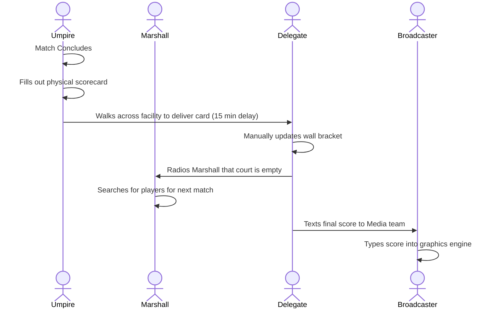
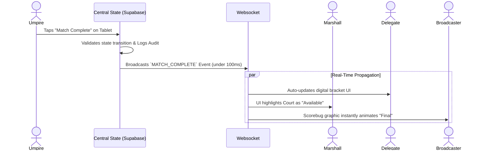

# Artifact 4 & 5: Fully Dressed Use Cases & Process Modeling

**Generated By:** Agent_03_ProcessModeler
**Domain Focus:** Behavioral Flows & State Space

## 1. Process Flow Models (As-Is vs. To-Be)

### 1.1 The "As-Is" Process (Traditional Manual Workflow)
*This demonstrates the latency and communication bottlenecks we are eliminating.*

### 1.2 The "To-Be" Process (Tennis Suite Event-Driven Workflow)
*This demonstrates the real-time, centralized state propagation of our architecture.*

---

## 2. Fully Dressed Use Cases

### Use Case 01: Offline Score Caching & Reconnection
*   **Use Case ID:** UC-01
*   **Case Name:** Umpire Offline Synchronization
*   **Primary Actor:** Umpire
*   **Preconditions:** Umpire is logged in and authenticated to a specific `Match ID`. The tournament is in the `LIVE` state.
*   **Trigger:** The Umpire's tablet loses Wi-Fi connectivity during active play.
*   **Main Success Scenario:**
    1. Umpire presses "Player A Scores Point".
    2. System detects `navigator.onLine === false`.
    3. System pushes mutation payload to `IndexedDB` local cache queue.
    4. UI displays "Offline Mode - 1 point cached".
    5. Connectivity is restored.
    6. System detects `online` event.
    7. System flushes the `IndexedDB` queue to the backend via a bulk GraphQL/REST mutation.
    8. Server validates chronological integrity via local timestamps.
    9. Server confirms sync; local cache is wiped.
*   **Extensions:** If the Umpire presses "Undo" while offline, the system simply pops the last event off the local cache queue before syncing.
*   **Exceptions:** If the tablet powers off entirely before syncing, data remains in `IndexedDB` and will sync upon next boot up.

### Use Case 02: Emergency Global Suspension
*   **Use Case ID:** UC-02
*   **Case Name:** Delegate Kill-Switch
*   **Primary Actor:** Delegate
*   **Preconditions:** Tournament is `LIVE`.
*   **Trigger:** Sudden severe weather (e.g., lightning storm).
*   **Main Success Scenario:**
    1. Delegate presses the Global "Suspend Tournament" button.
    2. System updates Tournament Object state to `SUSPENDED`.
    3. WebSocket blasts a `GLOBAL_SUSPENSION` event to all edge devices.
    4. All Umpire tablets overlay a hard lock screen preventing any score inputs.
    5. Broadcaster UI automatically pushes the "Weather Delay" presentation slate.
*   **Exceptions:** If an Umpire is offline when the event is fired, they will continue scoring locally. When they reconnect, the server will reject their cached points chronologically submitted *after* the suspension timestamp, forcing a rollback.
