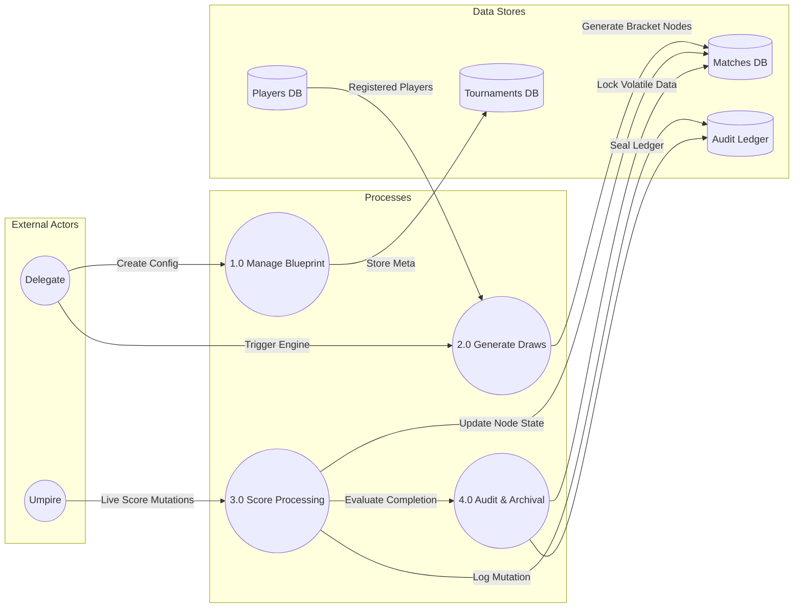
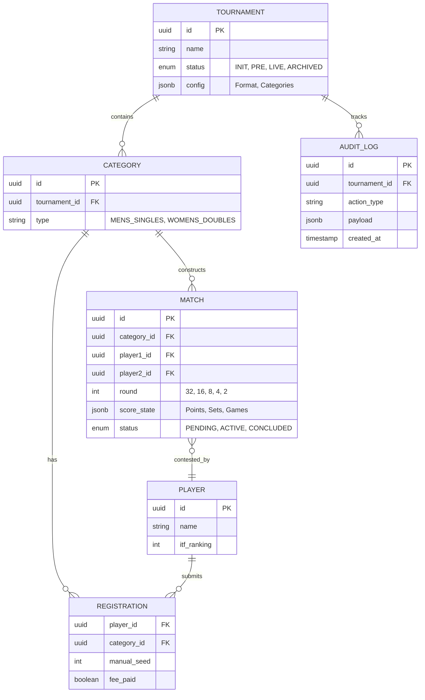

# Artifact 7: Conceptual Data Model & Design Architecture Models

**Generated By:** Agent_04_DataArchitect
**Domain Focus:** Schema Synthesis & Relational Constraints

## 1. Context Diagram (Level 0 DFD)
*Defines the boundaries of the system and external entity interactions.*

```mermaid
graph TD
    Umpire((Umpire))
    Delegate((Delegate))
    Marshall((Marshall))
    Broadcaster((Broadcaster))
    Fans((Fans / Players))
    
    System[<b>Tennis Suite Core System</b><br/>(State Machine, Auth, Draw Engine, WebSockets)]
    
    Umpire -- "Score Inputs, Match States" --> System
    System -- "Next Match Data" --> Umpire
    
    Delegate -- "Rules, Drafts, Overrides, Configs" --> System
    System -- "Audit Logs, Financials, Brackets" --> Delegate
    
    Marshall -- "Court Availability, Check-ins" --> System
    System -- "Queue Data" --> Marshall
    
    System -- "Sub-second JSON Score Payload" --> Broadcaster
    System -- "Public Brackets, Live Scores" --> Fans
```

## 2. Data Flow Diagram (DFD Level 1)
*Breaks down the core system into major functional processes.*



## 3. Entity Relationship Diagram (ERD Domain Model)
*Conceptual mapping of the relational constraints.*


